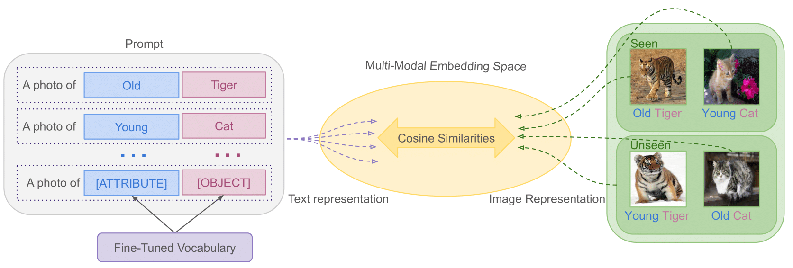

# Continual Compositional Soft Prompting (CSP)

This repository extends the original Compositional Soft Prompting (CSP) framework to a continual learning setting using knowledge distillation. The goal is to improve compositional zero-shot learning with large pretrained vision-language models while keeping the training efficient and avoiding full model fine-tuning.

Reference paper:
- Original CSP: [Learning to Compose Soft Prompts for Compositional Zero-Shot Learning](https://arxiv.org/abs/2204.03574)
- Continual setting: [Prompt-Based Continual Compositional Zero-Shot Learning](https://arxiv.org/abs/2512.09172)



## Overview

CSP learns a small set of soft prompts that are composed to represent attribute-object combinations. This makes it suitable for compositional zero-shot learning, where the model is evaluated on unseen attribute-object pairs using knowledge from seen combinations.

This repository supports:
- MIT-States
- UT-Zappos
- C-GQA
- continual learning with session-based training
- closed-world evaluation

## Key Features

- Parameter-efficient prompt learning
- CLIP-based compositional reasoning
- Continual adaptation across sessions
- Knowledge distillation for stable updates
- Support for dataset-specific training and evaluation scripts

## Project Structure

```text
CSP/
├── assets/
├── datasets/
├── models/
├── run/
├── utils/
├── train.py
├── evaluate.py
├── download_data.sh
├── requirements.txt
├── README.md
├── credits.md
└── ...
```

## Installation

We recommend using a conda environment.

```bash
conda create --name clip python=3.7
conda activate clip
pip install -r requirements.txt
```

If you want to install dependencies manually instead:

```bash
pip3 install torch torchvision torchaudio --extra-index-url https://download.pytorch.org/whl/cu113
pip3 install ftfy regex tqdm scipy pandas
pip3 install git+https://github.com/openai/CLIP.git
```

## Dataset Setup

Download the datasets `CCZSL_benchmark` and place under `data/` folder.

Make sure your dataset paths match the dataset reader files in the `datasets/` folder. For example:
- `mit_read_datasets.py`
- `utzappos_read_datasets.py`
- `cgqa_read_datasets.py`

Before training, confirm that the correct dataset paths are set in each file. In continual learning setups, the session-specific metadata path must also match the target session (for example, session 0 vs accumulated session data).

## Training

For session 0, run the session-specific training scripts directly:

```bash
bash run/run_train_utzappos_s0.sh
bash run/run_train_mitstates_s0.sh
bash run/run_train_cgqa_s0.sh
```

For later sessions, use the continual training scripts:

```bash
bash run/run_train_utzappos.sh
bash run/run_train_mitstates.sh
bash run/run_train_cgqa.sh
```

The training hyperparameters follow the original CSP setup, and the default knowledge distillation weight (`--alpha`) is set to `0.65` unless modified.

### Example training command

```bash
python -u train.py \
  --dataset mit-states \
  --clip_model ViT-L/14 \
  --experiment_name csp \
  --seed 0 \
  --epochs 20 \
  --lr 5e-05 \
  --attr_dropout 0.3 \
  --weight_decay 0.00001 \
  --train_batch_size 4 \
  --gradient_accumulation_steps 2 \
  --context_length 8 \
  --save_path data/model/mit-states/sample_model \
  --save_every_n 1
```

## Evaluation

We evaluate the trained model in the closed-world setting using the provided bash scripts:

```bash
bash run/run_test_utzappos.sh
bash run/run_test_mitstates.sh
bash run/run_test_cgqa.sh
```

You can also run evaluation manually with `evaluate.py`. For example:

```bash
python -u evaluate.py \
  --dataset mit-states \
  --clip_model ViT-L/14 \
  --soft_embeddings data/model/mit-states/sample_model/soft_embeddings_epoch_20.pt \
  --context_length 16 \
  --text_encoder_batch_size 36 \
  --eval_batch_size 16 \
  --experiment_name csp
```

## Notes

- `--dataset` can be set to `mit-states`, `utzappos`, or `cgqa`.
- The repository expects the dataset directory structure to be prepared before training.
- For open-world evaluation or feasibility calibration, additional preprocessing may be required depending on the experiment.

## Credits

This project uses open datasets and publicly available code. See [credits.md](credits.md) for details.

## Citation

If you use this work, please cite the project paper:

```bibtex
@misc{maryam2026promptbasedcontinualcompositionalzeroshot,
      title={Prompt-Based Continual Compositional Zero-Shot Learning},
      author={Sauda Maryam and Sara Nadeem and Faisal Qureshi and Mohsen Ali},
      year={2026},
      eprint={2512.09172},
      archivePrefix={arXiv},
      primaryClass={cs.CV},
      url={https://arxiv.org/abs/2512.09172}
}
```

Also, the original CSP method is available here:

```bibtex
@inproceedings{csp2023,
  title={Learning to Compose Soft Prompts for Compositional Zero-Shot Learning},
  author={Nihal V. Nayak and Peilin Yu and Stephen H. Bach},
  booktitle={International Conference on Learning Representations},
  year={2023}
}
```
