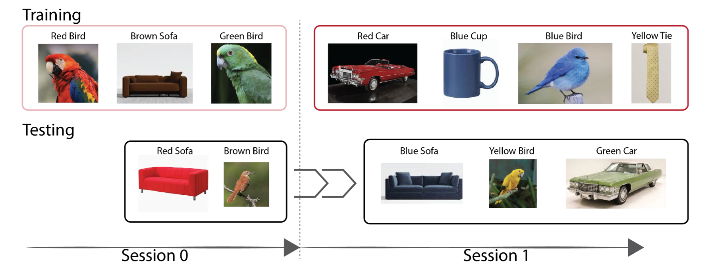
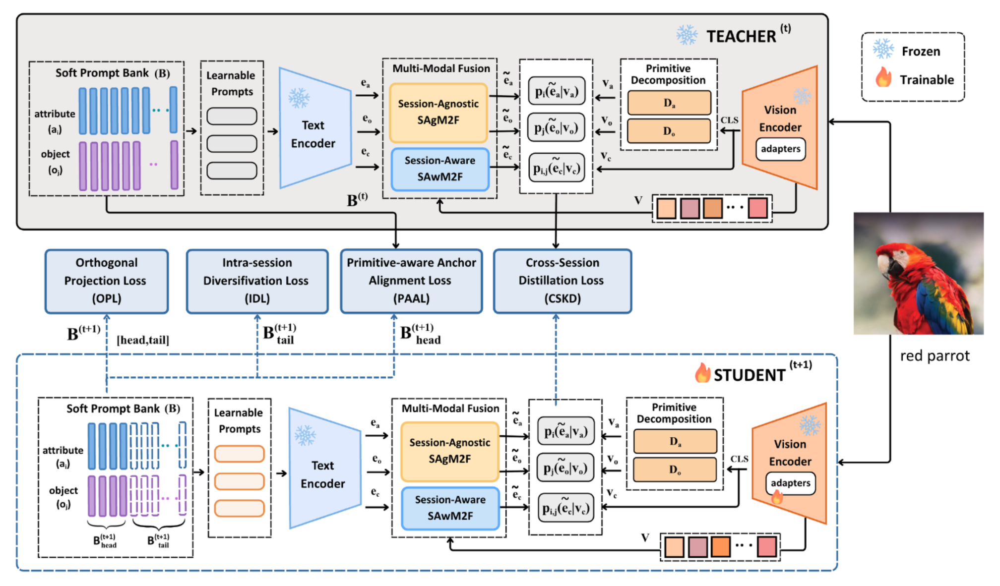

# Prompt-Based Continual Compositional Zero-Shot Learning

[[Paper (arXiv:2512.09172)]](https://arxiv.org/abs/2512.09172)

This repository holds the benchmark and reference loaders for
**Prompt-Based Continual Compositional Zero-Shot Learning** (PromptCCZSL).

## Overview

PromptCCZSL is a vision-language framework for Continual Compositional
Zero-Shot Learning (CCZSL). A CCZSL model incrementally learns new
attribute-object compositions across sessions while retaining knowledge
from earlier sessions. Attributes and objects recur across sessions,
but their compositions change. This setting produces semantic
interference, compositional drift, and catastrophic forgetting.

PromptCCZSL balances *stability* (retaining primitive and compositional
knowledge) and *plasticity* (adapting to new compositions). The paper
evaluates it on the three benchmarks in this repository against VLM and
non-VLM baselines.



## Method



The paper describes the architecture and training procedure in full.

## Datasets

The benchmark builds on three compositional zero-shot learning datasets,
re-partitioned into continual-learning sessions:

| Dataset       | Sessions | Total attrs | Total objs | Total pairs | Total images |
| ------------- | -------- | ----------- | ---------- | ----------- | ------------ |
| MIT-States    | 4 (0-3)  | 115         | 245        | 1,962       | 53,753       |
| UT-Zappos     | 3 (0-2)  | 16          | 12         | 116         | 29,126       |
| C-GQA         | 6 (0-5)  | 413         | 674        | 7,767       | 39,298       |

Each total reports the distinct value across the final cumulative
session (`session_N/cumulative/metadata_cumulative.t7` for the largest
`N`). Because CCZSL sessions revise their compositions, this cumulative
total exceeds any single session's own count.

### Per-dataset session data cards

#### MIT-States

| Session | attrs | objs | pairs (train/val/test/all) | images (train/val/test) | cumulative images |
| ------- | ----- | ---- | -------------------------- | ----------------------- | ----------------- |
| 0       |    37 |   71 | 161 / 76 / 90 / 237        | 3689 / 1139 / 1332      | n/a               |
| 1       |    59 |  126 | 278 / 145 / 187 / 439      | 6919 / 2546 / 2879      | 12,320            |
| 2       |    80 |  163 | 361 / 164 / 229 / 565      | 9010 / 3039 / 3869      | 34,422            |
| 3       |   106 |  207 | 462 / 215 / 294 / 721      | 10720 / 3696 / 4915     | 53,753            |

#### UT-Zappos

| Session | attrs | objs | pairs (train/val/test/all) | images (train/val/test) | cumulative images |
| ------- | ----- | ---- | -------------------------- | ----------------------- | ----------------- |
| 0       |     8 |    6 | 24 / 7 / 9 / 34            | 8448 / 774 / 1444       | n/a               |
| 1       |    11 |    8 | 27 / 10 / 14 / 39          | 5436 / 1013 / 961       | 18,076            |
| 2       |    15 |   10 | 32 / 13 / 13 / 43          | 9114 / 1427 / 509       | 29,126            |

UT-Zappos ships few pairs per session (at most 32 training pairs).
Metrics on this dataset shift more with random seed and split choice
than on MIT-States or C-GQA. Report multiple seeds.

#### C-GQA

| Session | attrs | objs | pairs (train/val/test/all) | images (train/val/test) | cumulative images |
| ------- | ----- | ---- | -------------------------- | ----------------------- | ----------------- |
| 0       |   233 |  363 | n/a / n/a / n/a / 3305     | 10014 / 2743 / 1961     | n/a               |
| 1       |   161 |  151 | 491 / 168 / 172 / 678      | 1798 / 342 / 338        | 17,196            |
| 2       |   172 |  360 | 772 / 358 / 265 / 1093     | 6531 / 1551 / 1030      | 26,308            |
| 3       |   178 |  384 | 836 / 366 / 275 / 1131     | 4541 / 1527 / 975       | 33,351            |
| 4       |   183 |  206 | 562 / 225 / 166 / 776      | 2375 / 613 / 421        | 36,760            |
| 5       |   170 |  238 | 539 / 217 / 203 / 784      | 1661 / 504 / 373        | 39,298            |

C-GQA session_0 has no per-split pair files. Its `all_pairs.txt` is a
master pool of the 3305 pairs that appear across the benchmark. The
per-image split assignments still live in the session_0 metadata file,
under the `set` field. Treat session_0 as a base warm-start.

## Directory layout

```
data/
├── mit-states/
│   ├── session_0/
│   │   ├── train_pairs.txt          # "attr obj" per line
│   │   ├── val_pairs.txt
│   │   ├── test_pairs.txt
│   │   ├── all_pairs.txt            # train ∪ val ∪ test, sorted
│   │   └── metadata_compositional-split-natural.t7    # torch.save(list[dict])
│   ├── session_1/
│   │   ├── ... (as above)
│   │   └── cumulative/
│   │       └── metadata_cumulative.t7      # images across sessions 0..1
│   ├── session_2/ ...
│   └── session_3/ ...
├── ut-zappos/     # same layout, sessions 0-2
└── CGQA/          # same layout, sessions 0-5

cczsl_benchmark/         # importable Python package: loaders and CLI modules
manifest.json            # per-file integrity manifest
```

### File formats

`{train,val,test,all}_pairs.txt` files hold plain text, one
`attr<space>obj` per line, sorted.

`metadata_compositional-split-natural.t7` files hold `torch.save`
archives despite the `.t7` extension. Each archive contains a
`list[dict]` with keys `{image, attr, obj, set}`, where `set` is
`"train"`, `"val"`, or `"test"`. Load with
`torch.load(..., weights_only=False)` or with
`cczsl_benchmark.load_metadata` (see below).

`cumulative/metadata_cumulative.t7` files share the same schema. Each
covers the union of sessions `0..N` for session `N`. Use them for
joint-evaluation protocols: a model trained through session `N` sees
everything seen so far.

## Download instructions (image data)

The image data is not redistributed here. Obtain it from the original
sources and place it at any path you choose. The loader records the
filename in the `image` field of each metadata entry.

* **MIT-States**: https://web.mit.edu/phillipi/Public/states_and_transformations/
  Extract so images live at `<mit-states-root>/images/<attr>_<obj>/*.jpg`.
* **UT-Zappos50K**: https://vision.cs.utexas.edu/projects/finegrained/utzap50k/
  Follow the fine-grained CZSL preprocessing from Naeem et al. 2021.
* **C-GQA** (derived from GQA, https://cs.stanford.edu/people/dorarad/gqa/):
  Use the C-GQA release from Naeem et al. 2021.

## Usage

The loader uses only the standard library for pair access. It imports
`torch` lazily when the caller asks for image-level metadata.

```python
from cczsl_benchmark import load_session, load_metadata, list_sessions

# Sessions available on disk
list_sessions("mit-states")            # [0, 1, 2, 3]

# One session's pair splits and metadata paths
s = load_session("mit-states", 1)
s.train_pairs                          # [("ancient", "highway"), ...]
s.attrs, s.objects                     # sorted uniques from all_pairs
s.metadata_path                        # Path to the .t7
s.cumulative_metadata_path             # Path to cumulative/.t7 (or None)

# Image-level metadata
md = load_metadata("mit-states", 1)                    # session-scoped
md_c = load_metadata("cgqa", 3, cumulative=True)       # cumulative 0..3
md[0]  # {'image': 'ancient_highway/234952612_570360a0f5_z.jpg',
       #  'attr': 'ancient', 'obj': 'highway', 'set': 'train'}
```

The loader accepts dataset name aliases (`cgqa`, `C-GQA`, `mit_states`,
and so on).

To work with plain JSON, run `python -m cczsl_benchmark.convert_t7_to_json`.
It writes a `.json` companion next to every `.t7`. Git ignores these
files; regenerate them as needed.

## Evaluation protocol

The benchmark supports two evaluation modes per session `N`:

1. *Session-scoped*: train and evaluate on `session_N` alone, using
   `metadata_compositional-split-natural.t7`. Measures raw plasticity.
2. *Cumulative (0..N)*: evaluate on the union of sessions `0..N`, using
   `cumulative/metadata_cumulative.t7`. Measures stability and
   plasticity together. This is the CCZSL protocol reported in the
   paper.

Refer to the paper for the exact metric definitions used in the tables.

## Reproducibility and integrity

`manifest.json` records the size, MD5, and structural count for every
file under `data/`. Pair files carry a `line_count`. Metadata
files carry an `entry_count`. To verify a fresh clone:

```bash
python -m cczsl_benchmark.validate_benchmark
# OK: 72 files verified
```

To regenerate the manifest after intentional changes:

```bash
python -m cczsl_benchmark.build_manifest
```

To rebuild a cumulative metadata file from its session-scoped
components (the semantic rule is
`cumulative_0..N = concat(session_0, ..., session_N)`):

```bash
python -m cczsl_benchmark.build_cumulative ut-zappos 2   # one file
python -m cczsl_benchmark.build_cumulative --all         # every cumulative file
```

Run `python -m cczsl_benchmark.validate_benchmark` in CI or as a
pre-push hook. It catches truncation, corruption, or unintended
modification of any file.

## Gallery

`cczsl_benchmark.gallery` renders a browsable HTML gallery for a
session. Images are grouped by (attr, obj), colored by split (train,
val, test), and capped at a fixed number of samples per pair.

```bash
python -m cczsl_benchmark.gallery mit-states 1 \
    --images-root ~/data/mit-states/images \
    --split train --per-pair 4 \
    --out gallery_ms_1_train.html

python -m cczsl_benchmark.gallery cgqa 3 --cumulative \
    --images-root ~/data/cgqa/images --per-pair 1 \
    --out gallery_cgqa_cum_3.html
```

The script writes only HTML: `` tags resolve at browser-render
time against `--images-root`. Supply the image data separately (see the
Download section above). Sampling is deterministic under `--seed`.

## Git LFS

All `.t7` metadata files live in Git LFS. So do other likely-large
binary types (`.pt`, `.pth`, `.ckpt`, `.safetensors`, and archives). To
work with the repository:

```bash
git lfs install                  # once per machine
git clone <this-repo>            # LFS pointers resolve automatically
```

A clone without LFS installed yields text pointer files instead of the
real `.t7` bytes. Run `git lfs install && git lfs pull` to retrieve them.

## License

CC-BY-4.0 covers the benchmark artifacts and code in this repository.
See `LICENSE`. The underlying image datasets are not redistributed here
and remain under their original licenses.

## Citation

```bibtex
@article{maryam2025promptcczsl,
  title  = {Prompt-Based Continual Compositional Zero-Shot Learning},
  author = {Sauda Maryam and Sara Nadeem and Faisal Qureshi and Mohsen Ali},
  year   = {2025},
  eprint = {2512.09172},
  archivePrefix = {arXiv},
  primaryClass  = {cs.CV},
  url    = {https://arxiv.org/abs/2512.09172}
}
```

`CITATION.cff` provides the same reference for reference-manager import.
