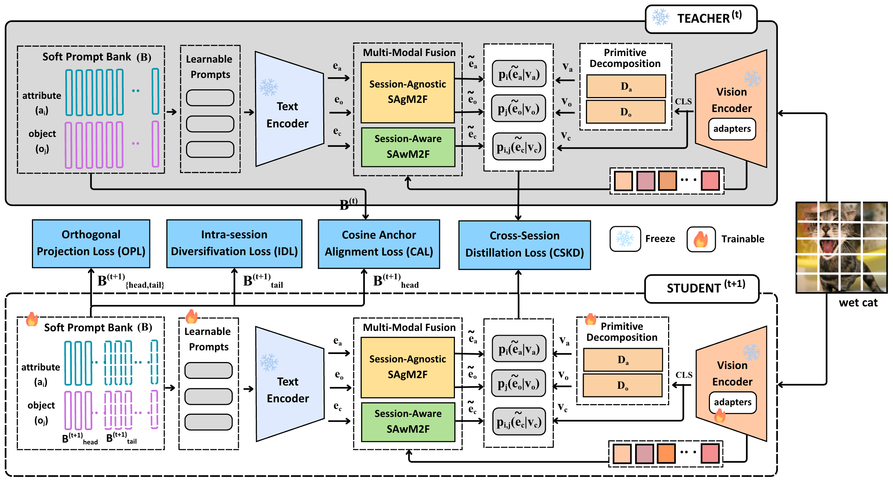

# Prompt-CCZSL: Prompt-Based Continual Compositional Zero-Shot Learning

* **Title**: **[Prompt-Based Continual Compositional Zero-Shot Learning](https://arxiv.org/pdf/2512.09172)**
* **Authors**: Sauda Maryam , Sara Nadeem, Faisal Z. Qureshi, Mohsen Ali
* **Institutes**: Information Technology University Lahore
* **More details**: [[arXiv]](https://arxiv.org/pdf/2512.09172) | [[code]](https://github.com/Sauda123/Prompt-CCZSL) )

---

## Overview
## Methodology Overview

  

**Figure:** Overview of the proposed Prompt-CCZSL framework for continual compositional zero-shot learning.

With a focus on enabling stable and scalable learning of compositional concepts over time, we introduce Prompt-based Continual Compositional Zero-Shot Learning (Prompt-CCZSL), a novel framework that integrates continual learning principles into vision–language models for incremental acquisition of attribute–object compositions. Our approach formulates compositional learning through learnable prompts that are updated across sessions via a session-aware compositional fusion mechanism, allowing the model to adapt to newly introduced attributes, objects, and compositions while preserving previously learned semantic structure. To further mitigate catastrophic forgetting, we propose a continual adaptation strategy based on multi-teacher knowledge distillation, complemented by a Cosine Anchor Alignment Loss that enforces semantic consistency across sessions. Additionally, orthogonality and intra-session diversification constraints promote representation separability and enriched session-specific semantics in the prompt space. Extensive experiments demonstrate that Prompt-CCZSL achieves strong continual compositional generalization and significantly outperforms competitive CCZSL baselines under constrained continual settings.

---

## Results

Quantitative and qualitative results will be released upon paper acceptance.

---

## Code Structure

